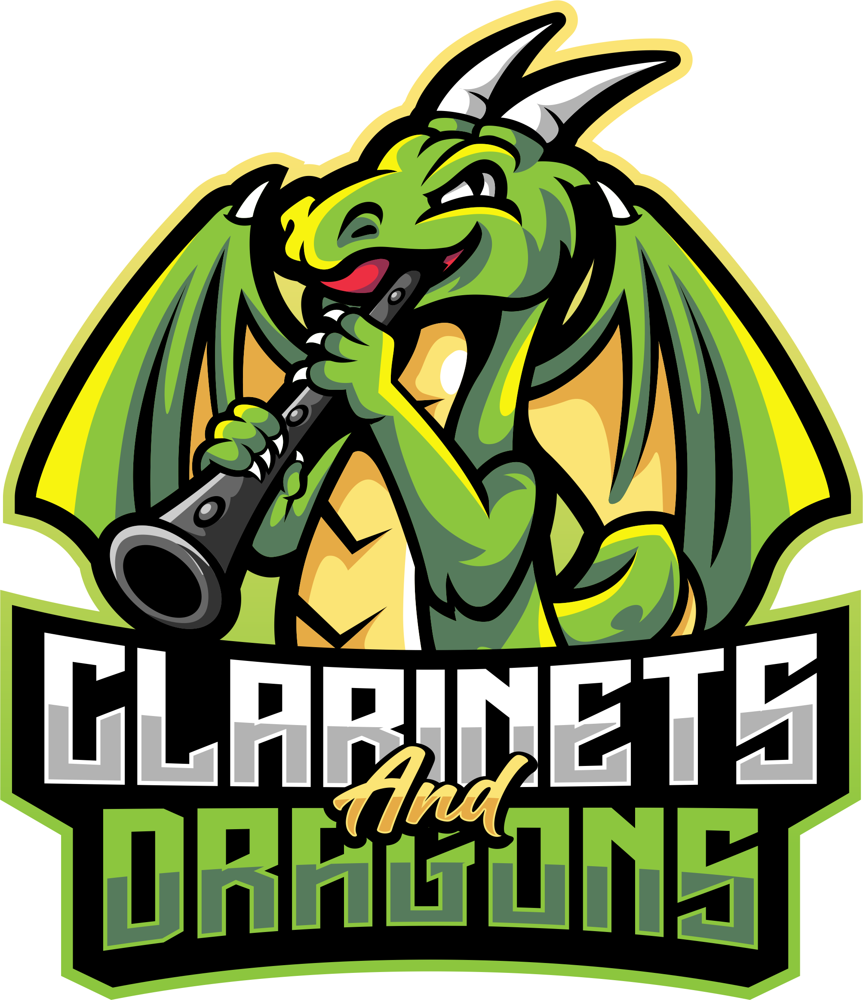
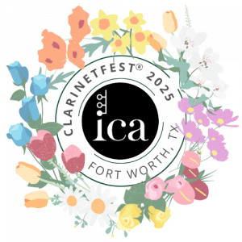

  

[![Static Badge](https://img.shields.io/badge/Play%20Clarinets%20and%20Dragons%20-%20%238cc63e?style=for-the-badge&logo=data:image/png;base64,iVBORw0KGgoAAAANSUhEUgAAABgAAAAYCAYAAADgdz34AAAACXBIWXMAAACxAAAAsQHGLUmNAAAAGXRFWHRTb2Z0d2FyZQB3d3cuaW5rc2NhcGUub3Jnm+48GgAAAr5JREFUSIm11O1LE3EAB/Dvtvvdkbu7zT0wtznEkqkTXPliCIoyLX1h2gNhCL6oXvSqVxFBvfRPiCAIIlAJCh+CyqAnyB6gogwVMqwwslbhdpvb7m5P9+uFS0gUnFvfdwd3n++X+x1nwH8Ix3G9DMM8MhgMXKltI1/GX2YJm2tpbqEcx30tJc5yhHvornCrLYFWyhKWCoJwuGQ6R7jHHrdH8fv81GF3aNZy62ipbCvHcXcC+wJRn9dHXRUujS/jXwIwAgBTrF7pqjyiqmoXISxLCKHR1egbWZaDAFJFF1jMlqGezp5TSVlmp57cQyaTeZrH17PjAr6Mv1pTXdMvK4ppbmGW6nS6yXgifrqYwetxOV03REHU+roPUX+DXxN4YbokMLC2vMnflLs5fIsKgkit5dZJAM+2ul9XKO7d4z2ezqZFwhIsfloMJZKJIQBeAGeLKnA6nKPV1dUD4UhYT/SEhn6HJsKRcALAbgDtAOhmz+m3u1xW5IETgyf1ZtGMPP4AgAJg/1b4tmKz2YbtVnumt6uPmk1mahJNXwDcBnAFBb7iTZd3tnfmLpy7SO02O7VarGMAnAAmAIhF442+xtU6bx0NtgWppdzyHsAggMpCnM3OQE8Ima731vf7fXsFHdXR2fnZiYgUSQA4CuB7IQWGDdcm3sjfrXJXBeLJhCDFJPrx88LPZDI5jrV/y3kAiUIKdAzDdDMM4yEG4iMsOdbW3OYSeNHw4vVzGvoVequoyhkAtQBGsIOvheF38dfrvXV8WIoYO1o79Kl0GkvLS5Bi0oyiKoE8+qpQ+G/0GtXGCcNqfQcOqiuRFSSVJOY/zMWlqBTcyeKNMaTSqfvhWNij5bQGNaUyM3Mz+kwmM6KoylixOJA/5HQ6PSXFolUOm6OW5425b6Hla9ls9l0pCv6JyIuXzIL5B8MwXaUy/wBfpQSDO/wItAAAAABJRU5ErkJggg==&logoColor=%23333333&labelColor=%238CC63E&color=%23333333)](https://google.com)

# Clarinets and Dragons (Demo)

**Play (clarinet), Roll, Overcome**

Created by Jeffrey Kitson and Kristin Steelman

To play "Clarinets and Dragons" for yourself: [Game Tracker](https://jeffkitson-music.github.io/cnd).

To read the sample adventures, please explore the [adventures directory](/adventures).

## :musical_note: ClarinetFest 2025 Presentation

  

### Abstract: A Pedagogy of Gamification To Reach Disengaged Students

Jayden couldn't be bothered with his clarinet lessons. Traditional teaching strategies weren't working. That is until he became Sir Clarinetto, a hero defending the town of Sharpsburg from all manner of musical mayhem. All it took was a pair of dice and a little creativity.

Incorporating role-playing game mechanics into lessons, students embark on musical adventures where they overcome challenges and trials by performing specific musical techniques - long tones become tests of courage, scales transform into battles against dissonant creatures, and mastered repertoire may at long last vanquish the forces of discord.

This session will showcase the core mechanics of "Clarinets and Dragons," demonstrate its application in lessons, and provide materials and ideas for instructors wishing to use gamification to reach disengaged students.

While "Clarinets and Dragons" is for teachers and students of all ages, this presentation will be of particular interest to instructors working with students aged 11-15.

## :scroll: Adventures and Lore
- For sample adventures, lore, and other game resources please visit the [adventures directory](/adventures).
- Want to create your own adventures? Go for it! Want to add them officially? See "Contributing" in this guide. 

## 🤝 Contributing

We welcome contributions to the "Clarinets and Dragons" project! If you're interested in improving the game, adding adventures, expanding the concepts, or contributing in any way:

* Please review our [Code of Conduct](CODE_OF_CONDUCT.md).

* How to Contribute:
    - Create an discussion topic in the "Issues" tab.
    - Contact the creators directly. We'd love to hear your ideas!
    - If you are comfortable with Git/GitHub, please fork and create a pull request.
   
## :bookmark_tabs: Libraries

This project utilizes the following libraries and resources:

* [ConfettiJS](https://confetti.js.org/)
* [sweetalert2](http://sweetalert2.github.io/)
* [TailwindCSS](https://tailwindCSS.com)
* Icons by [Flaticon](https://flaticon.com) and [FontAwesome](https://fontawesome.com)

## 📚 Bibliography

* Di Blasi, Maria, Alessandro Giardina, Cecilia Giordano, Gianluca Lo Coco, Crispino Tosto, Joel Billieux, and Adriano Schimmenti. "Problematic video game use as an emotional coping strategy: Evidence from a sample of MMORPG gamers." *Journal of Behavioral Addictions* 8, no. 1 (2019): 25–34. <https://pmc.ncbi.nlm.nih.gov/articles/PMC7044601/>.

* HG Team. "Video Games and Mental Health Explained | Healthy Gamer." *Healthy Gamer*. Last modified June 23, 2020. <https://www.healthygamer.gg/blog/video-games-and-mental-health-explained>.

* Stuart, Keith. "Video games aren't about power – they're about agency." *The Guardian*, October 16, 2015. <https://www.theguardian.com/technology/2015/oct/16/video-games-power-agency-control>.

* Wizards of the Coast LLC. "System Reference Document." *Dungeons & Dragons*. Last modified May 27, 2025. <https://dnd.wizards.com/resources/systems-reference-document>.

* Wysocki, Matthew. 2013. *Ctrl-Alt-Play : Essays on Control in Video Gaming*. Jefferson, N.C.: McFarland & Co.

## :memo: Attribution

### Dungeons & Dragons
This work includes material taken from the System Reference Document 5.1 (“SRD 5.1”) by Wizards of the Coast LLC and available at [https://dnd.wizards.com/resources/systems-reference-document](https://dnd.wizards.com/resources/systems-reference-document). The SRD 5.1 is licensed under the Creative Commons Attribution 4.0 International License available at [https://creativecommons.org/licenses/by/4.0/legalcode](https://creativecommons.org/licenses/by/4.0/legalcode).

### Logos
"Clarinets and Dragons" and "Lyrecrest Academy" logos by [Putri Febiyan](https://www.fiverr.com/cantikdesign).

## 📣 Shoutouts 

We'd like to express our gratitude to:

* [The International Clarinet Association](https://clarinet.org) and ClarinetFest® 
* [Central Community College](https://cccneb.edu)
* [Northview Public Schools](https://nvps.net)
* Brandon Bender, English Instructor at Central Community College
* Shannon MacDonald,  Library Resource Center Supervisor at Central Community College
* [Blizzard Entertainment](https://blizzard.com) for far too many hours of fun and frustration in [World of Warcraft](https://worldofwarcraft.blizzard.com/en-us/start).
* "Jayden," the clarinet student who inspired CnD when his D&D plans made him too stressed for his lesson.

## ✉️ Contact

For questions, collaborations, or more information about "Clarinets and Dragons," please contact:

* Jeffrey Kitson: jkitson[@]cccneb.edu
* Kristin Steelman: kristinsteelman423[@]gmail.com

## ⚖️ License

This work is licensed under the [Creative Commons Attribution-NonCommercial-ShareAlike 4.0 International License](https://creativecommons.org/licenses/by-nc-sa/4.0/).
